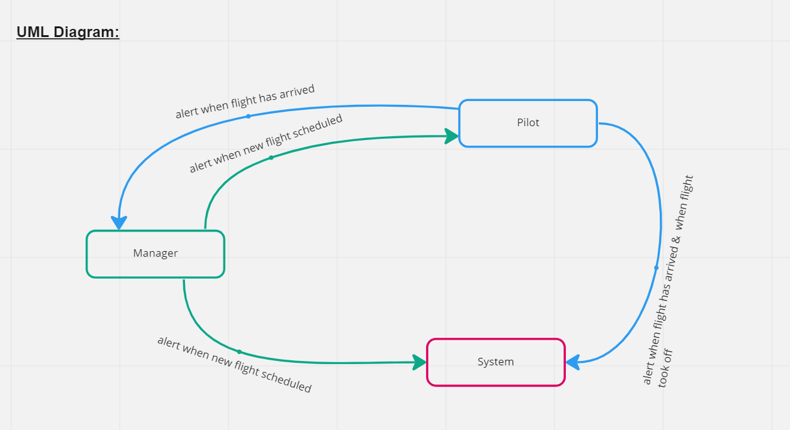

# airline-system

> A control system for an Airline (Royal Jordanian Airlines) to keep tracking each flight status by contacting the pilot of that flight who in turn will inform the manager and the system when a flight took-off and arrived.

## UML Diagram:

